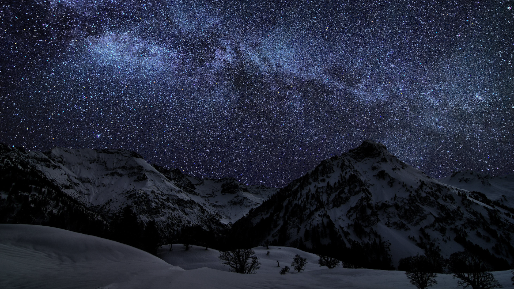

# Cold Fog

A cold, desaturated dark theme for [Omarchy](https://omarchy.org/) — muted blue-greys, low-contrast
ANSI colors, and macOS-style squircle window corners. Ships the whole desktop config, not just the
palette: Hyprland look'n'feel and the theme hooks that retint GTK, VS Code, Discord, fish, Steam and
friends.



Built for **Omarchy 4** (developed against 4.0.0.alpha / Hyprland 0.56.2). Omarchy 4 moved Hyprland
config from `.conf` to Lua, replaced Waybar with the Quickshell-based Omarchy shell, and relocated
the staged current theme from `~/.config/omarchy/current/` to `~/.local/state/omarchy/current/`.
Everything here targets that layout.

## Install

```bash
git clone https://github.com/Alexis-Reillo-Segarra/omarchy-cold-fog.git
cd omarchy-cold-fog
./install.sh
```

That installs the theme, the theme hooks, and the Hyprland look'n'feel, then applies it. Anything it
overwrites is backed up beside the original first.

```bash
./install.sh --theme-only   # palette, icons and wallpaper only
./install.sh --no-apply     # install without running `omarchy theme set`
```

`omarchy theme install <url>` also works and is fine if all you want is the palette — but see
[What a repo install cannot deliver](#what-a-repo-install-cannot-deliver) for what it drops.

To remove the theme:

```bash
omarchy theme remove cold-fog
```

## What's in here

| Path | Purpose |
|------|---------|
| `colors.toml` | The palette, plus the Hyprland border colors. Omarchy renders every themed config (alacritty, ghostty, foot, kitty, btop, helix, obsidian, the shell/bar, hyprlock, VS Code, Neovim, …) from this file at `omarchy theme set` time. |
| `icons.theme` | GTK icon theme (`Yaru-grey`). |
| `neovim.lua` | LazyVim spec — Kanagawa Dragon, transparent background. |
| `vscode.json` | Points VS Code at its built-in `Default Dark Modern`. |
| `backgrounds/` | Wallpapers. Cycle with `omarchy theme bg next`. |
| `desktop/hypr/looknfeel.lua` | Window rounding, gaps and blur — the parts of the look Omarchy 4 has no per-theme hook for. |
| `desktop/hooks/` | `theme-set` driver plus 19 hooklets that retint apps Omarchy does not theme itself. |
| `install.sh` | Puts all of the above where it belongs. |

Anything not shipped here is generated from `colors.toml` using Omarchy's templates in
`/usr/share/omarchy/default/themed/*.tpl`.

## Palette

`mode = "dark"`

| Role | Hex |
|------|-----|
| Background | `#10171A` |
| Foreground | `#C4D0D2` |
| Accent | `#9FB0B4` |
| Cursor | `#D8E2E4` |
| Active border | `#9FB0B4` |
| Inactive border | `#283638` |
| Selection | `#DDE6E8` on `#2A383C` |

Full ANSI 0–15 in [`colors.toml`](colors.toml).

## Window borders

Omarchy 3 let a theme ship a `hyprland.conf` with a raw `general { col.active_border = … }` block.
Omarchy 4 generates the theme's `hyprland.lua` from `default/themed/hyprland.lua.tpl`, which reads
two optional keys out of `colors.toml`:

```toml
hyprland_active_border   = "rgb(9FB0B4)"
hyprland_inactive_border = "rgb(283638)"
```

Both accept a single color or a Hyprland gradient (`"rgba(798186ee) rgba(caccccee) 45deg"`). Omit
either and Omarchy falls back to `accent` for the active border and Hyprland's grey
`rgba(595959aa)` for the inactive one.

Cold Fog sets only `hyprland_inactive_border`. Its active border is the accent, which is already the
fallback — and `hyprland_active_border` does double duty in `shell.toml`, where it also feeds
`active-border-foreground`. Setting it there would pull the bar's accent text off `foreground`
(`#C4D0D2`) and onto the dimmer border grey, so the key is left alone on purpose.

## Rounded corners, gaps and blur

Window decoration is a *global* look'n'feel setting in Omarchy 4, not a per-theme one, so it lives in
[`desktop/hypr/looknfeel.lua`](desktop/hypr/looknfeel.lua) rather than in the theme itself:

```lua
hl.config({
  general = { gaps_in = 8, gaps_out = 30 },
  decoration = {
    rounding = 12,
    rounding_power = 3.0,
    blur = { enabled = true, brightness = 0.90, contrast = 0.90 },
  },
})
```

`rounding_power` is what makes this read as macOS rather than "just rounded". At the default `2.0`
the corner is a circular arc; above `2.0` the curve becomes superelliptic — a squircle — and eases
into the straight edge instead of meeting it abruptly. `3.0` is a good middle ground; `4.0` is the
maximum. Requires Hyprland 0.47+.

Blur is off by default in Omarchy 4, so it has to be enabled explicitly for the brightness and
contrast values to do anything. They are raised well above Omarchy 3's old `0.60`/`0.75`, which
darkened the backdrop before translucing it and ate most of the effect.

Prefer square windows and tighter gaps? Run `./install.sh --theme-only` — the rest of the theme is
unaffected.

## Theme hooks

Omarchy themes the apps it knows about. [`desktop/hooks/`](desktop/hooks) covers the rest: GTK 3/4,
Qt6, VS Code / Cursor / Windsurf, Discord (Vencord), fish, fzf, Firefox, Zen, qutebrowser, Steam,
Heroic, cava, Typora, superfile, vicinae, nwg-dock and Spotify.

`theme-set` is the driver. It reads `colors.toml` from the staged current theme, exports every color
as a shell variable, and runs each hooklet in `theme-set.d/` in name order. A hooklet whose app is
not installed prints `[SKIPPED]` and exits 0, so the set is safe to install wholesale.

Add your own by dropping an executable script into `~/.config/omarchy/hooks/theme-set.d/`. It gets
`$primary_background`, `$normal_red`, `$bright_blue`, … plus `$rgb_*` variants, and the theme slug as
`$1`. Start it with the guard the shipped hooklets use:

```bash
# omarchy-hook also walks theme-set.d/ on its own, without the exported colors.
# Without this guard hooklets run twice and the second pass writes empty colors.
[[ -z $primary_background ]] && exit 0
```

One integration is optional: the driver calls [omazed](https://github.com/bjarneo/omazed) to
generate a Zed theme, guarded by `command -v omazed`, so machines without it are unaffected.

## The bar

There is nothing to configure here, and that is the point. Omarchy 4 dropped Waybar for a
Quickshell-based shell, so a theme no longer ships bar CSS — the bar is retinted automatically from
`colors.toml` through `default/themed/shell.toml.tpl`.

Layout is separate from theming and lives in `~/.config/omarchy/shell.json`, which is yours, not the
theme's. Cold Fog deliberately leaves it alone. Use `omarchy bar` to change it:

```bash
omarchy bar put omarchy.keyboard-layout --after omarchy.clock
omarchy bar set omarchy.clock format "dd/MM HH:mm"
omarchy bar position bottom
omarchy bar reset          # back to the Omarchy default layout
```

To override the generated bar colors, drop a `shell.toml` in this repo — it replaces the generated
one and survives a repo install.

## What a repo install cannot deliver

When a theme is installed from a git repo, Omarchy 4 refuses to stage anything that runs code,
because a theme from a stranger should not be able to execute anything. That means every `*.lua`
(so `neovim.lua`), the terminal configs `alacritty.toml` / `foot.ini` / `ghostty.conf` /
`kitty.conf`, and `vscode.json`. Omarchy names the skipped files on stderr:

```
Ignored in ~/.config/omarchy/themes/cold-fog: neovim.lua vscode.json
```

Hooks are not staged either — they live in `~/.config/omarchy/hooks/`, outside the theme entirely.

Omarchy tells a repo-installed theme from a hand-written one by the `.git` directory the clone
leaves behind. `install.sh` copies the theme files in *without* it, which is why the full install
gets the Neovim and VS Code settings and `omarchy theme install` does not.

## Development

The installed copy lives at `~/.config/omarchy/themes/cold-fog`, and Omarchy builds
`~/.local/state/omarchy/current/theme` from it, so editing this repo alone changes nothing on a
running system. Re-run `./install.sh` after a change.

Add `OMARCHY_THEME_SKIP_BACKGROUND=1` in front of `omarchy theme set` to keep your current wallpaper
instead of rotating to the theme's first background.

Verify what actually landed:

```bash
hyprctl getoption general:col.active_border    # expect ff9fb0b4
hyprctl getoption general:col.inactive_border  # expect ff283638
hyprctl getoption decoration:rounding          # expect 12
hyprctl configerrors                           # expect empty
omarchy hook theme-set cold-fog                # re-run the hooks alone
```

## Wallpaper

`backgrounds/1-cold-fog-starry-night.png` — snow-covered peaks under the Milky Way. Provenance is
not recorded in this repo; check the source terms before redistributing, or swap in your own by
dropping files into `backgrounds/` and re-running `./install.sh`.

## License

[MIT](LICENSE) for the configuration in this repo. The wallpaper is not covered by it.
